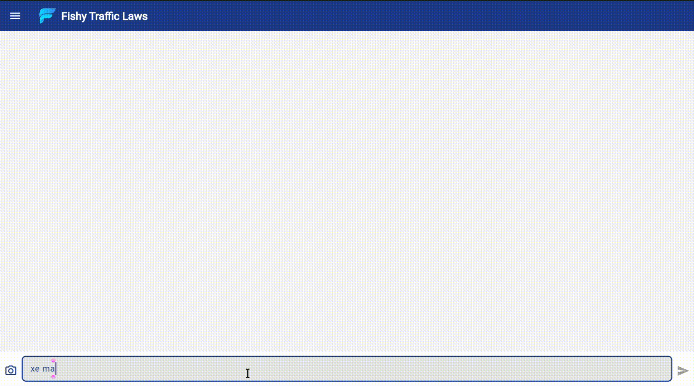
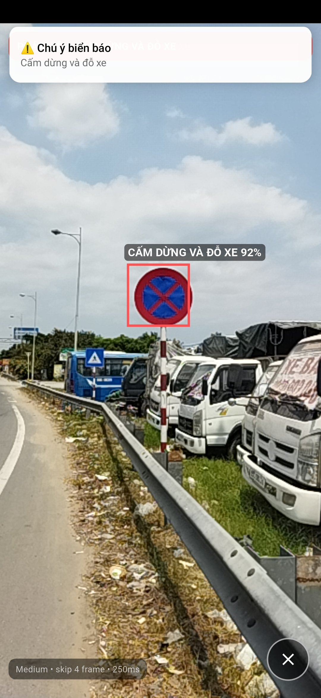
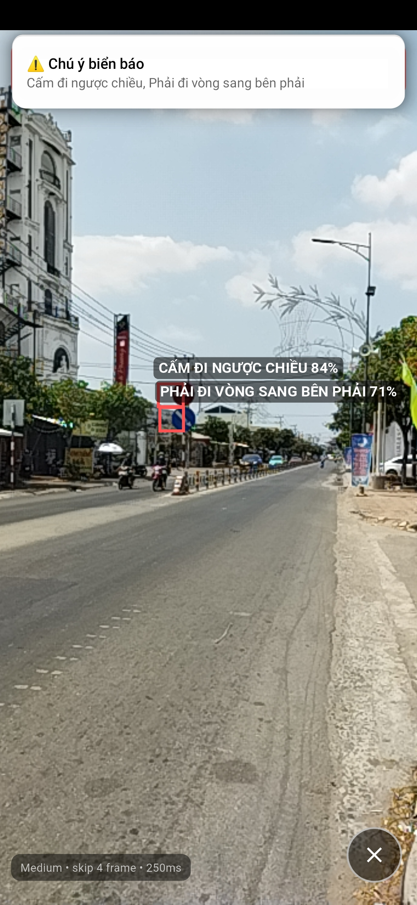
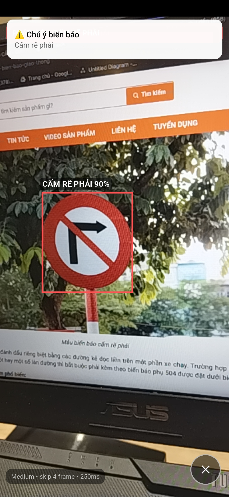
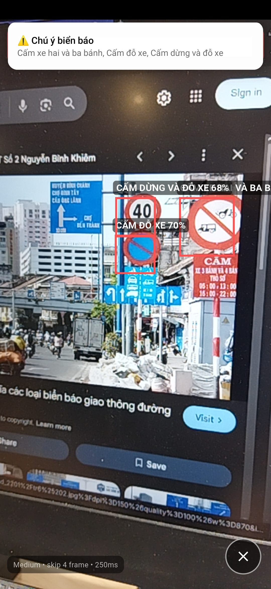

# Fishy

FISHY là hệ thống hỗ trợ tra cứu luật giao thông và nhận diện biển báo trong cùng một ứng dụng. Repository hiện gồm:

- App Flutter đa nền tảng (Android và Web).
- Backend RAG/FastAPI để hỏi đáp luật giao thông.
- Backend legal ingest để nạp văn bản pháp luật từ file.
- Backend YOLO để nhận diện ảnh khi dùng on-device model.
- Bộ script đánh giá chất lượng RAG.

<p align="center">
  
  
  
  
</p>
## Kiến trúc hiện tại

```text
Flutter App
  |- Supabase Auth + Database
  |   |- nguoidung
  |   |- lich_su_tro_chuyen
  |   |- vanbanphapluat
  |   |- noidung
  |   |- noidung2
  |   |- nguon_uy_tin
  |   |- bai_viet_uy_tin
  |   `- app_config
  |
  |- Trusted RAG API (:8000)
  |   |- legal retrieval từ Supabase RPC
  |   |- trusted cache retrieval
  |   |- Firecrawl fallback
  |   |- CrossEncoder rerank
  |   `- OpenAI answer generation
  |
  |- Legal Ingest API (:8010)
  |   |- extract text từ pdf/docx/txt
  |   |- parse phân cấp bằng LLM
  |   |- generate embedding
  |   `- insert vào noidung2
  |
  |- YOLO API (:8001)
  |   `- detect / detect-lite
  |
  `- On-device YOLO Lite
```

## Flow hiện tại

### 1. Khởi động app

- `lib/main.dart` load `.env`, khởi tạo Supabase, local notifications và các `Provider`.
- App gọi:
  - `ChatService.initializeApiUrl()`
  - `LegalIngestService.initializeApiUrl()`
  - `LocalNotiService.init()`
  - `LocalYoloService.instance.init()`
- URL backend được đọc từ bảng `app_config` với các key:
  - `rag_url`
  - `yolo_url`
  - `legal_ingest_url`

### 2. Đăng nhập và phân quyền

- App dùng `supabase_flutter` cho đăng nhập, đăng ký, đăng xuất.
- Sau khi auth thành công, app đọc thêm hồ sơ từ bảng `nguoidung`.
- Trạng thái tài khoản được kiểm tra qua `matrangthai_tk`.
- Một số màn quản trị chỉ mở cho user có vai trò phù hợp trong `nguoidung`.

### 3. Hỏi đáp luật giao thông

- Người dùng gửi câu hỏi ở `ChatScreen`.
- `ChatViewModel` giữ lại tối đa 5 lượt hội thoại text gần nhất để gửi kèm.
- App gọi `POST /chat` tới backend RAG.
- Backend đang dùng thực tế là `server/RAG/trusted_rag_app.py`, không phải flow cũ trong `langchain2.py`.
- Pipeline hiện tại:
  - embedding câu hỏi bằng `intfloat/multilingual-e5-large`
  - truy vấn legal DB qua RPC `match_legal_docs_v3`
  - nếu legal evidence chưa đủ thì tìm trong trusted cache
  - nếu trusted cache vẫn chưa đủ thì gọi Firecrawl để tìm và scrape nguồn uy tín
  - rerank ứng viên bằng `BAAI/bge-reranker-v2-m3`
  - sinh câu trả lời bằng OpenAI model cấu hình trong `.env`
- Router hỗ trợ cả:
  - `POST /api/chat/ask`
  - `POST /chat`
- App hiện đang dùng `POST /chat`.

### 4. Nhận diện biển báo từ ảnh

- Khi người dùng chọn ảnh gallery hoặc chụp ảnh:
  - app ưu tiên chạy `LocalYoloService` on-device trên Android
- Kết quả trả về gồm:
  - `summary`
  - `boxes`
  - `w`, `h`
- Flutter dùng `BBoxPainter` để vẽ bounding box lên ảnh gốc trong khung chat.

### 5. Nhận diện realtime

- `RealtimeDetectScreen` mở camera sau và stream frame liên tục.
- Realtime hiện chạy qua `LocalYoloService.detectCameraFrame(...)`.
- Flow hiện tại là local-first, không phụ thuộc YOLO server cho realtime.
- Khi phát hiện biển báo:
  - kết quả được đẩy vào chat
  - hiện toast trên màn hình
  - bắn local notification

### 6. Quản trị dữ liệu luật

- `AddLawScreen` thêm metadata văn bản vào `vanbanphapluat`.
- Cùng màn này có nút upload file sang legal ingest API.
- Legal ingest API:
  - nhận `pdf`, `docx`, `txt`
  - extract text
  - segment theo cấu trúc pháp lý
  - parse bằng LLM
  - sinh embedding
  - insert vào bảng `noidung2`
- Song song đó, app vẫn còn flow nhập tay cũ:
  - `AddLawContentScreen`
  - `AddContentVM`
  - insert trực tiếp vào bảng `noidung`
  - sinh embedding từ app qua Hugging Face

## Thành phần chính

### Flutter app

- `lib/main.dart`: entrypoint.
- `lib/Views/`: các màn hình chính.
- `lib/ViewModels/`: state management với `provider`.
- `lib/Services/ChatService.dart`: gọi RAG và YOLO backend, đọc URL động từ `app_config`.
- `lib/Services/LegalIngestService.dart`: upload file văn bản sang legal ingest API.
- `lib/Services/LocalYoloService.dart`: YOLO TFLite on-device.
- `lib/Services/EmbeddingService.dart`: flow cũ để sinh embedding trực tiếp từ app.

### RAG backend

- `server/RAG/trusted_rag_app.py`: backend RAG đang khớp flow hiện tại.
- `server/RAG/router/chat_router.py`: expose `/chat` và `/api/chat/ask`.
- `server/RAG/services/retrieval_service.py`: legal retrieval, trusted cache, Firecrawl fallback, rerank.
- `server/RAG/services/answer_service.py`: generate final answer và source list.
- `server/RAG/services/trusted_web_cache_service.py`: quản lý nguồn web uy tín.
- `server/RAG/services/firecrawl_service.py`: search/scrape nguồn uy tín khi cần fallback.

### Legal ingest backend

- `server/RAG/legal_ingest_app.py`: app FastAPI cho ingest văn bản.
- `server/RAG/router/legal_document_router.py`: route upload ingest.
- `server/RAG/services/noidung2_ingest_service.py`: pipeline insert vào `noidung2`.

### YOLO backend

- `server/Yolo/app.py`: backend YOLO hiện tại.
- `server/Yolo/model/best.pt`: model đang được server load mặc định.
- `server/Yolo/classes_vie.txt`: label tiếng Việt.

### Đánh giá RAG

- `server/RAG/danh_gia_rag.py`: pipeline generate, judge, build report.
- `server/RAG/danh_gia_rag.jsonl`: bộ câu hỏi đánh giá hiện đang mở trong IDE.
- `server/RAG/eval_set_manifest.md`: mô tả dataset đánh giá.
- `server/RAG/danh_gia_rag/`: nơi lưu predictions, scores, summary, biểu đồ.

## Yêu cầu môi trường

### Flutter app

- Flutter SDK tương thích với `sdk: ^3.7.0`
- Android Studio / Xcode / Windows toolchain tùy nền tảng chạy app

## Cách chạy local

### 1. Cài dependency Flutter

```bash
flutter pub get
```

### 2. Cài dependency Python

RAG:

```bash
cd server/RAG
pip install -r requirements.txt
```

YOLO:

```bash
cd server/Yolo
pip install -r requirements.txt
```

### 3. Chạy Trusted RAG API

```bash
cd server/RAG
uvicorn trusted_rag_app:app --host 0.0.0.0 --port 8000 --reload
```

### 4. Chạy Legal Ingest API

```bash
cd server/RAG
uvicorn legal_ingest_app:app --host 0.0.0.0 --port 8010 --reload
```

### 5. Chạy YOLO API

```bash
cd server/Yolo
uvicorn app:app --host 0.0.0.0 --port 8001 --reload
```

### 6. Chạy Flutter app

```bash
flutter run
```

## Chạy đánh giá RAG

Từ `server/RAG`:

```bash
python danh_gia_rag.py --mode generate_only --eval-file danh_gia_rag.jsonl
python danh_gia_rag.py --mode judge_only
python danh_gia_rag.py --mode build_report
```

Hoặc chạy full:

```bash
python danh_gia_rag.py --mode full --eval-file danh_gia_rag.jsonl
```

Trong repo cũng đã có `server/run.txt` ghi lại một số lệnh chạy nhanh và preset threshold.

## Tóm tắt ngắn

Fishy hiện là codebase lai giữa:

- app Flutter cho người dùng cuối và quản trị viên,
- trusted legal RAG có fallback ra nguồn web uy tín,
- legal ingest backend để nạp văn bản vào `noidung2`,
- YOLO local-first cho mobile và server fallback cho các nền tảng còn lại.
